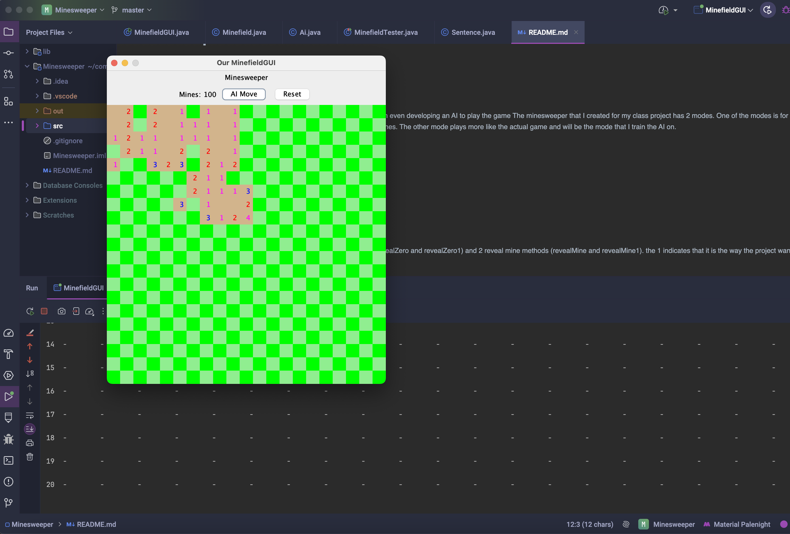
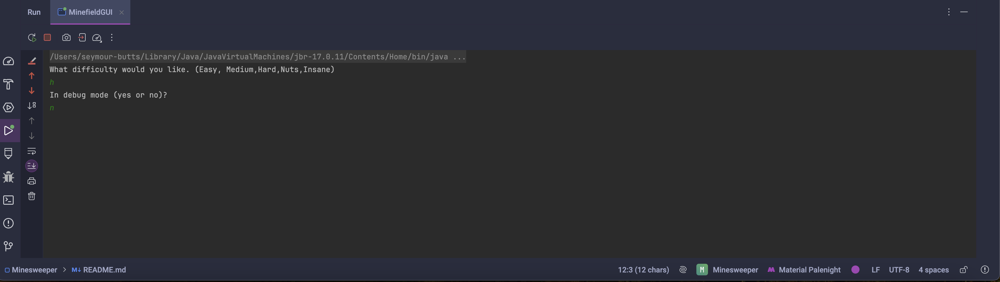
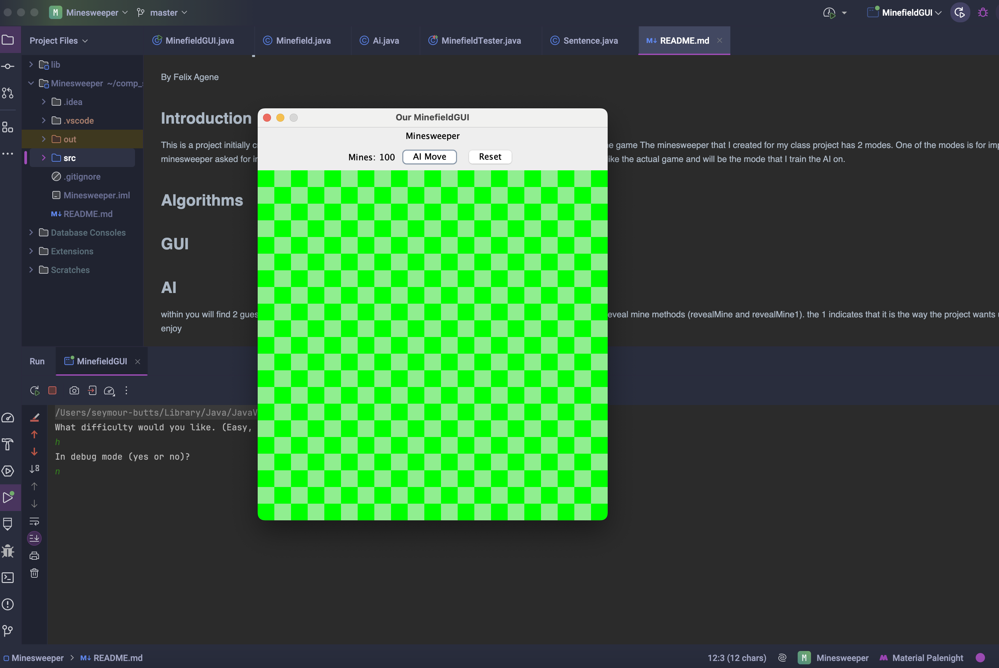

# Minesweeper

## Introduction
This is a project initially created for a school project but slowly as I kept researching I added a lot more functionalities like a GUI for interacting. 
The minesweeper that I created for my class project has 2 modes. One of the modes is for implementation of minesweeper asked for in the project directions, in specific in the methods revealMines. 
The other mode plays more like the actual game and will be the mode that I train the AI on. 

They're 5 possible levels with varying grid sizes and mine amounts. You can choose to play the game or let the AI make moves for you by clicking the AI Move button. The GUI is written in Java Swing. 

## Algorithms
The Minesweeper project utilizes several algorithms to implement the gameplay, specifically the AI agent's decision making capabilities, based on concepts in propositional logic and knowledge representation.
The AI agent, designed with a knowledge-based system, makes its decisions using a series of logical AI algorithms that make inferences based on the agent's knowledge.

1. **Guess Methods (guess and guess1)**: These algorithms are responsible for making reasonable guesses when the AI doesn't have enough safe moves. Guess1 method implements it according to the project specification, while guess is used for the realistic game mode.

2. **Reveal Zero Methods (revealZero and revealZero1)**: These functions are used to reveal cells that have no mines neighboring them and utilizes DFS to search all surrounding cells until either only mines are surrounding or walls. When a cell with no mine neighbors is clicked, these functions reveal all the adjacent cells, as they are guaranteed to be safe. Cells revealed this way which also have no mine neighbors continue to reveal their neighbors in a cascading manner.

3. **Reveal Mine Methods (revealMine and revealMine1)**: These functions reveal the location of mines when a cell that contains a mine is clicked. Thi method uses BFS and reveals all surrounding mines until a wall is reached.

The AI primarily uses the concept of propositional logic to make its decisions, constructing knowledge sentences based on the count of neighboring mines for each cell. Over time, these sentences are used to infer which cells are safe to click next, and which cells contain mines.

The complexity of expressions representing knowledge is handled using a concise representation involving sets of cells and counts, allowing inference of safe moves and potential mines from subset relationships between sentences in our AI's knowledge.

The development of the AI also included a certain level of 'learning' as it improved with each game played. It does this by using the 'add_knowledge' function to update information about mines, safe cells, and moves made after each step.

These algorithms work together to provide the AI agent with a sophisticated decision-making process that allows it to solve the Minesweeper puzzle to the best of its abilities. 
## GUI - Minefield

The `MinefieldGUI` class provides a graphical user interface (GUI) for a minefield game.

### Overview

The Minefield GUI implements the user interface with various Java Swing components such as `JButton`, `JLabel`, `JPanel`, `JFrame`, and `MouseListener`. The program responds to player actions and updates the game board accordingly.

### Design 

The GUI is created with a grid layout, where each cell represents a label added to a panel. The label's background color is determined by its position on the grid. The main GUI window includes a label to show the count of remaining mines, buttons for AI's move and game reset. 

### Mouse Clicks

The GUI responds to both left and right mouse clicks. 

- A left-click is used to reveal a cell. 
- A Ctrl + left-click flags or unflags a mine. 

### Game Reset 

The 'Reset' button resets entirely the game state: it resets variables to their default values and reinitializes the game board GUI. 
This GUI implementation endeavors to provide a satisfying and visually intuitive playing experience for Minefield.
## AI
Although this AI is deterministically optimal in its decision-making, the inherent randomness introduced in the game of Minesweeper (primarily at the initial stages of the game) does place an upper bound on the AI's win rate. Hence, in some cases, the AI, despite its optimal strategy, will inevitably trigger a mine.
The AI class contains two critical data structures: a list of Sentences (`knowledge`) that the AI has learned about the game board, and a Set of moves that it has made (`movesMade`). These gather and store the AI's understanding of the board's state.

A `Sentence` in this context represents a block of knowledge about the game's board. It comprises a set of board cells and a count of the number of mines in these cells. Throughout the game, the AI will generate multiple sentences to inform its understanding of the mines left on the board.

### Essential Methods

#### `addKnowledge()`

`addKnowledge()` is the primary function for growing the AI's understanding of the game. After making a move, it passes the cell on which the move was made and the count of mines in the surrounding cells to `addKnowledge()`. This method then updates the AI's knowledge base with new information derived from that move.

#### `makeSafeMove()`, `makeRandomMove()`

These functions are used to make a move given the current knowledge base. `makeSafeMove()` makes a move to a cell that the AI knows to be safe. If no known safe move is available, `makeRandomMove()` is used to make a best-guess move.

The `AI` class provides an AI player in a game of minesweeper through systematic inferences about the state of the game board. It smartly navigates the game, making safe moves where possible and educated guesses when necessary.

Made By: Felix Agene